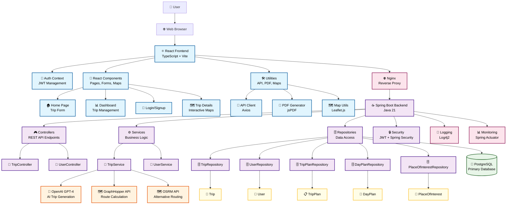
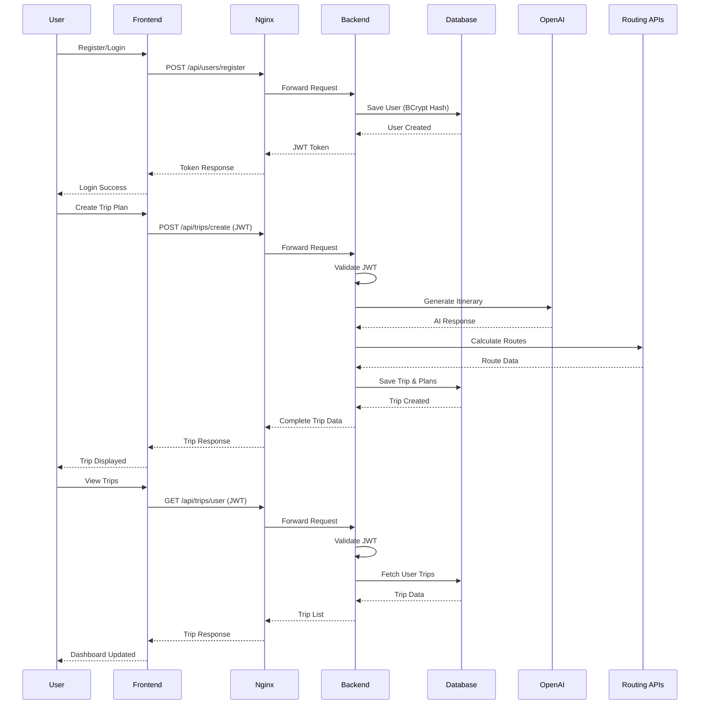
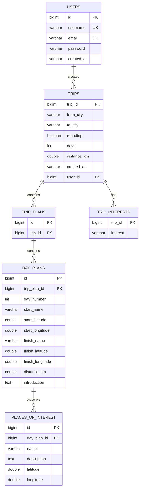
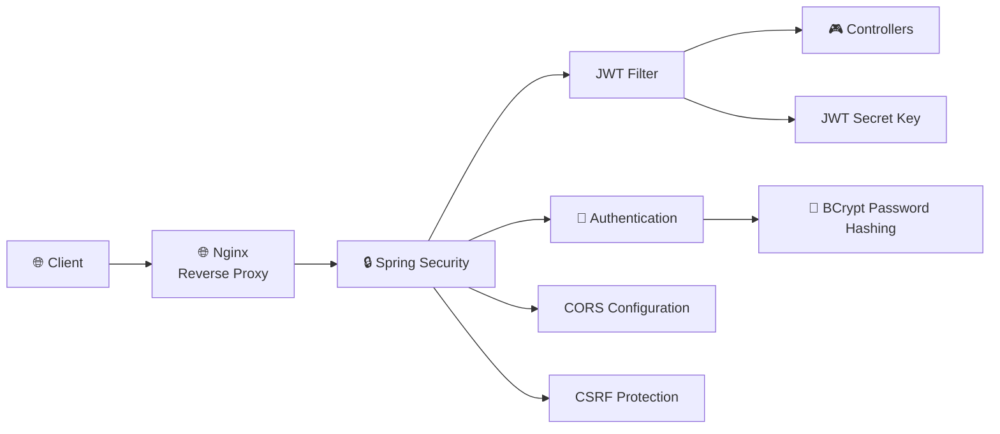
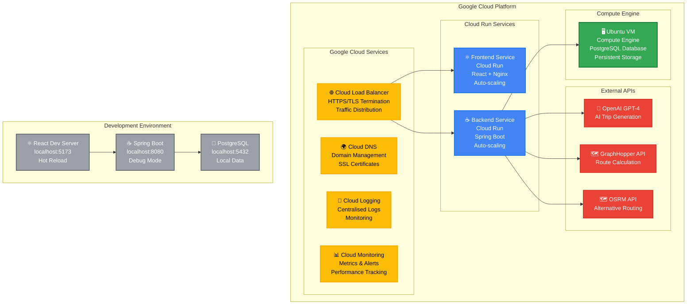
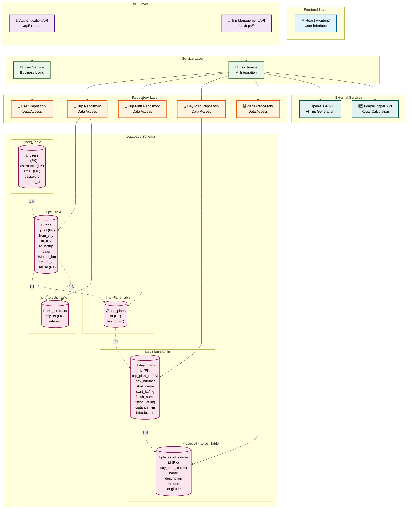
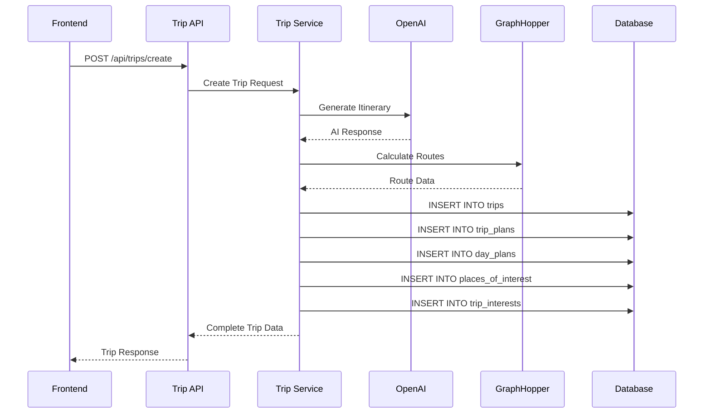
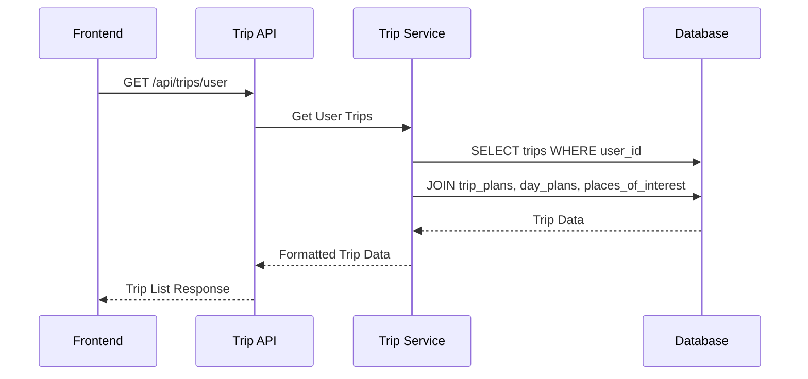

# Roadtrip.ai System Architecture Diagram

## Overview
Roadtrip.ai is a full-stack AI-powered road trip planning application that generates personalised itineraries using OpenAI's GPT-4. The system follows a modern microservices-inspired architecture with clear separation of concerns.

## System Architecture



## Data Flow Architecture



## Database Schema



## Component Architecture

### Frontend Components
```
src/
├── components/
│   ├── Button.tsx              # Reusable button component
│   ├── Card.tsx                # Card display component
│   ├── Header.tsx              # Navigation header
│   ├── Hero.tsx                # Landing page hero section
│   ├── TripForm.tsx            # Trip creation form
│   ├── TripCard.tsx            # Trip display card
│   ├── TripDetails.tsx         # Detailed trip view
│   ├── DayDetails.tsx          # Day-by-day itinerary
│   ├── TripOverviewMap.tsx     # Interactive map component
│   └── PDFDownloadButton.tsx   # PDF export functionality
├── pages/
│   ├── Home.tsx                # Landing page
│   ├── Login.tsx               # Authentication page
│   ├── SignUp.tsx              # User registration
│   └── Dashboard.tsx           # Main user dashboard
├── context/
│   └── AuthContext.tsx         # JWT authentication state
├── utils/
│   ├── api.ts                  # API client utilities
│   ├── pdfGenerator.ts         # PDF generation
│   ├── routeService.ts         # Route calculation
│   └── viteEnv.ts              # Environment configuration
└── styles/
    ├── index.css               # Global styles
    ├── Hero.css                # Hero section styles
    └── leaflet.css             # Map styles
```

### Backend Components
```
src/main/java/com/adendl/traveljournalai/
├── controller/
│   ├── TripController.java     # Trip REST endpoints
│   └── UserController.java     # User authentication endpoints
├── service/
│   ├── TripService.java        # Trip business logic + AI integration
│   └── UserService.java        # User management logic
├── repository/
│   ├── TripRepository.java     # Trip data access
│   ├── UserRepository.java     # User data access
│   ├── TripPlanRepository.java # Trip plan data access
│   └── DayPlanRepository.java  # Day plan data access
├── model/
│   ├── User.java               # User entity
│   ├── Trip.java               # Trip entity
│   ├── TripPlan.java           # Trip plan entity
│   ├── DayPlan.java            # Day plan entity
│   ├── PlaceOfInterest.java    # Place of interest entity
│   └── Location.java           # Location embeddable
├── config/
│   ├── SecurityConfig.java     # Spring Security configuration
│   ├── JwtConfig.java          # JWT configuration
│   └── JwtRequestFilter.java   # JWT authentication filter
└── utils/
    └── LoggingUtils.java       # Logging utilities
```

## Technology Stack

### Frontend
- **Framework**: React 18 with TypeScript
- **Build Tool**: Vite
- **Styling**: Tailwind CSS
- **Maps**: Leaflet.js + React Leaflet
- **Routing**: React Router DOM
- **Animations**: Framer Motion
- **PDF Generation**: jsPDF
- **HTTP Client**: Axios
- **Testing**: Jest + React Testing Library

### Backend
- **Framework**: Spring Boot 3
- **Language**: Java 21
- **Build Tool**: Gradle
- **Security**: Spring Security + JWT
- **Database**: PostgreSQL with JPA/Hibernate
- **Testing**: JUnit 5 + Mockito + Spring Boot Test
- **Logging**: Log4j2
- **Monitoring**: Spring Actuator

### Infrastructure
- **Web Server**: Nginx
- **Containerisation**: Docker
- **Database**: PostgreSQL
- **External APIs**: OpenAI GPT-4, GraphHopper, OSRM

## Security Architecture



## Deployment Architecture



## API-Database Interaction Diagram



## API Endpoint Details

### Authentication Endpoints
| Method | Endpoint | Description | Database Operations |
|--------|----------|-------------|-------------------|
| `POST` | `/api/users/register` | User registration | `INSERT INTO users` |
| `POST` | `/api/users/login` | User authentication | `SELECT FROM users WHERE username` |
| `GET` | `/api/users/me` | Get current user | `SELECT FROM users WHERE id` |

### Trip Management Endpoints
| Method | Endpoint | Description | Database Operations |
|--------|----------|-------------|-------------------|
| `POST` | `/api/trips/create` | Create new trip | `INSERT INTO trips`, `trip_plans`, `day_plans`, `places_of_interest`, `trip_interests` |
| `GET` | `/api/trips/user` | Get user's trips | `SELECT FROM trips WHERE user_id` with JOINs |
| `DELETE` | `/api/trips/{id}` | Delete trip | `DELETE FROM trips` (cascades to related tables) |

## Database Operations Flow

### Trip Creation Process


### Data Retrieval Process

