# Roadtrip.ai System Architecture Diagram

## Overview
Roadtrip.ai is a full-stack AI-powered road trip planning application that generates personalised itineraries using OpenAI's GPT-4. The system follows a modern microservices-inspired architecture with clear separation of concerns.

## System Architecture

```mermaid
graph TB
    %% External Users
    User["👤 User"] --> Browser["🌐 Web Browser"]
    
    %% Frontend Layer
    Browser --> Frontend["⚛️ React Frontend\nTypeScript + Vite"]
    Frontend --> AuthContext["🔐 Auth Context\nJWT Management"]
    Frontend --> Components["🧩 React Components\nPages, Forms, Maps"]
    
    %% Frontend Components
    Components --> HomePage["🏠 Home Page\nTrip Form"]
    Components --> Dashboard["📊 Dashboard\nTrip Management"]
    Components --> LoginPage["🔑 Login/Signup"]
    Components --> TripDetails["🗺️ Trip Details\nInteractive Maps"]
    
    %% Frontend Utilities
    Frontend --> Utils["🛠️ Utilities\nAPI, PDF, Maps"]
    Utils --> APIClient["📡 API Client\nAxios"]
    Utils --> PDFGenerator["📄 PDF Generator\njsPDF"]
    Utils --> MapUtils["🗺️ Map Utils\nLeaflet.js"]
    
    %% API Gateway/Load Balancer
    Frontend --> Nginx["🌐 Nginx\nReverse Proxy"]
    Nginx --> Backend["☕ Spring Boot Backend\nJava 21"]
    
    %% Backend Layer
    Backend --> Controllers["🎮 Controllers\nREST API Endpoints"]
    Backend --> Services["⚙️ Services\nBusiness Logic"]
    Backend --> Repositories["🗄️ Repositories\nData Access"]
    Backend --> Security["🔒 Security\nJWT + Spring Security"]
    
    %% Backend Components
    Controllers --> TripController["🚗 TripController"]
    Controllers --> UserController["👤 UserController"]
    
    Services --> TripService["🚗 TripService"]
    Services --> UserService["👤 UserService"]
    
    Repositories --> TripRepo["🗄️ TripRepository"]
    Repositories --> UserRepo["🗄️ UserRepository"]
    Repositories --> TripPlanRepo["🗄️ TripPlanRepository"]
    Repositories --> DayPlanRepo["🗄️ DayPlanRepository"]
    Repositories --> PlaceOfInterestRepo["🗄️ PlaceOfInterestRepository"]
    
    %% Model Layer
    TripRepo --> TripModel["🚗 Trip"]
    UserRepo --> UserModel["👤 User"]
    TripPlanRepo --> TripPlanModel["📋 TripPlan"]
    DayPlanRepo --> DayPlanModel["📅 DayPlan"]
    PlaceOfInterestRepo --> PlaceOfInterestModel["📍 PlaceOfInterest"]
    
    %% Database Layer
    Repositories --> Database[("🐘 PostgreSQL\nPrimary Database")]
    
    %% External APIs
    TripService --> OpenAI["🤖 OpenAI GPT-4\nAI Trip Generation"]
    TripService --> GraphHopper["🗺️ GraphHopper API\nRoute Calculation"]
    TripService --> OSRM["🗺️ OSRM API\nAlternative Routing"]
    
    %% Infrastructure
    Backend --> Logging["📝 Logging\nLog4j2"]
    Backend --> Monitoring["📊 Monitoring\nSpring Actuator"]
    
    %% Styling
    classDef frontend fill:#e1f5fe,stroke:#01579b,stroke-width:2px,color:#000
    classDef backend fill:#f3e5f5,stroke:#4a148c,stroke-width:2px,color:#000
    classDef database fill:#e8f5e8,stroke:#1b5e20,stroke-width:2px,color:#000
    classDef external fill:#fff3e0,stroke:#e65100,stroke-width:2px,color:#000
    classDef infrastructure fill:#fce4ec,stroke:#880e4f,stroke-width:2px,color:#000
    classDef model fill:#fffde7,stroke:#fbc02d,stroke-width:2px,color:#000
    
    class Frontend,AuthContext,Components,HomePage,Dashboard,LoginPage,TripDetails,Utils,APIClient,PDFGenerator,MapUtils frontend
    class Backend,Controllers,Services,Repositories,Security,TripController,UserController,TripService,UserService,TripRepo,UserRepo,TripPlanRepo,DayPlanRepo,PlaceOfInterestRepo backend
    class Database database
    class OpenAI,GraphHopper,OSRM external
    class Nginx,Logging,Monitoring infrastructure
    class TripModel,UserModel,TripPlanModel,DayPlanModel,PlaceOfInterestModel model
```



## Data Flow Architecture


## Database Schema


## Component Architecture

### Frontend Components
```
src/
├── components/
│   ├── Button.tsx              # Reusable button component
│   ├── Card.tsx                # Card display component
│   ├── Header.tsx              # Navigation header
│   ├── Hero.tsx                # Landing page hero section
│   ├── TripForm.tsx            # Trip creation form
│   ├── TripCard.tsx            # Trip display card
│   ├── TripDetails.tsx         # Detailed trip view
│   ├── DayDetails.tsx          # Day-by-day itinerary
│   ├── TripOverviewMap.tsx     # Interactive map component
│   └── PDFDownloadButton.tsx   # PDF export functionality
├── pages/
│   ├── Home.tsx                # Landing page
│   ├── Login.tsx               # Authentication page
│   ├── SignUp.tsx              # User registration
│   └── Dashboard.tsx           # Main user dashboard
├── context/
│   └── AuthContext.tsx         # JWT authentication state
├── utils/
│   ├── api.ts                  # API client utilities
│   ├── pdfGenerator.ts         # PDF generation
│   ├── routeService.ts         # Route calculation
│   └── viteEnv.ts              # Environment configuration
└── styles/
    ├── index.css               # Global styles
    ├── Hero.css                # Hero section styles
    └── leaflet.css             # Map styles
```

### Backend Components
```
src/main/java/com/adendl/traveljournalai/
├── controller/
│   ├── TripController.java     # Trip REST endpoints
│   └── UserController.java     # User authentication endpoints
├── service/
│   ├── TripService.java        # Trip business logic + AI integration
│   └── UserService.java        # User management logic
├── repository/
│   ├── TripRepository.java     # Trip data access
│   ├── UserRepository.java     # User data access
│   ├── TripPlanRepository.java # Trip plan data access
│   └── DayPlanRepository.java  # Day plan data access
├── model/
│   ├── User.java               # User entity
│   ├── Trip.java               # Trip entity
│   ├── TripPlan.java           # Trip plan entity
│   ├── DayPlan.java            # Day plan entity
│   ├── PlaceOfInterest.java    # Place of interest entity
│   └── Location.java           # Location embeddable
├── config/
│   ├── SecurityConfig.java     # Spring Security configuration
│   ├── JwtConfig.java          # JWT configuration
│   └── JwtRequestFilter.java   # JWT authentication filter
└── utils/
    └── LoggingUtils.java       # Logging utilities
```

## Technology Stack

### Frontend
- **Framework**: React 18 with TypeScript
- **Build Tool**: Vite
- **Styling**: Tailwind CSS
- **Maps**: Leaflet.js + React Leaflet
- **Routing**: React Router DOM
- **Animations**: Framer Motion
- **PDF Generation**: jsPDF
- **HTTP Client**: Axios
- **Testing**: Jest + React Testing Library

### Backend
- **Framework**: Spring Boot 3
- **Language**: Java 21
- **Build Tool**: Gradle
- **Security**: Spring Security + JWT
- **Database**: PostgreSQL with JPA/Hibernate
- **Testing**: JUnit 5 + Mockito + Spring Boot Test
- **Logging**: Log4j2
- **Monitoring**: Spring Actuator

### Infrastructure
- **Web Server**: Nginx
- **Containerisation**: Docker
- **Database**: PostgreSQL
- **External APIs**: OpenAI GPT-4, GraphHopper, OSRM

## Security Architecture

```mermaid
graph LR
    Client[🌐 Client] --> Nginx[🌐 Nginx<br/>Reverse Proxy]
    Nginx --> Security[🔒 Spring Security]
    Security --> JWT[JWT Filter]
    JWT --> Controllers[🎮 Controllers]
    
    Security --> Auth[🔐 Authentication]
    Security --> CORS[CORS Configuration]
    Security --> CSRF[CSRF Protection]
    
    Auth --> BCrypt[🔐 BCrypt Password Hashing]
    JWT --> JWTSecret[JWT Secret Key]
```



## Deployment Architecture


## API-Database Interaction Diagram

```mermaid
graph TB
    subgraph "Frontend Layer"
        ReactApp["⚛️ React Frontend<br/>User Interface"]
    end
    
    subgraph "API Layer"
        AuthAPI["🔐 Authentication API<br/>/api/users/*"]
        TripAPI["🚗 Trip Management API<br/>/api/trips/*"]
    end
    
    subgraph "Service Layer"
        UserService["👤 User Service<br/>Business Logic"]
        TripService["🚗 Trip Service<br/>AI Integration"]
    end
    
    subgraph "Repository Layer"
        UserRepo["🗄️ User Repository<br/>Data Access"]
        TripRepo["🗄️ Trip Repository<br/>Data Access"]
        TripPlanRepo["🗄️ Trip Plan Repository<br/>Data Access"]
        DayPlanRepo["🗄️ Day Plan Repository<br/>Data Access"]
        PlaceRepo["🗄️ Place Repository<br/>Data Access"]
    end
    
    subgraph "Database Schema"
        subgraph "Users Table"
            Users[("👤 users<br/>id (PK)<br/>username (UK)<br/>email (UK)<br/>password<br/>created_at")]
        end
        
        subgraph "Trips Table"
            Trips[("🚗 trips<br/>trip_id (PK)<br/>from_city<br/>to_city<br/>roundtrip<br/>days<br/>distance_km<br/>created_at<br/>user_id (FK)")]
        end
        
        subgraph "Trip Plans Table"
            TripPlans[("📋 trip_plans<br/>id (PK)<br/>trip_id (FK)")]
        end
        
        subgraph "Day Plans Table"
            DayPlans[("📅 day_plans<br/>id (PK)<br/>trip_plan_id (FK)<br/>day_number<br/>start_name<br/>start_lat/lng<br/>finish_name<br/>finish_lat/lng<br/>distance_km<br/>introduction")]
        end
        
        subgraph "Places of Interest Table"
            Places[("📍 places_of_interest<br/>id (PK)<br/>day_plan_id (FK)<br/>name<br/>description<br/>latitude<br/>longitude")]
        end
        
        subgraph "Trip Interests Table"
            Interests[("🎯 trip_interests<br/>trip_id (FK)<br/>interest")]
        end
    end
    
    subgraph "External Services"
        OpenAI["🤖 OpenAI GPT-4<br/>AI Trip Generation"]
        GraphHopper["🗺️ GraphHopper API<br/>Route Calculation"]
    end
    
    %% API to Service connections
    AuthAPI --> UserService
    TripAPI --> TripService
    
    %% Service to Repository connections
    UserService --> UserRepo
    TripService --> TripRepo
    TripService --> TripPlanRepo
    TripService --> DayPlanRepo
    TripService --> PlaceRepo
    
    %% Repository to Database connections
    UserRepo --> Users
    TripRepo --> Trips
    TripPlanRepo --> TripPlans
    DayPlanRepo --> DayPlans
    PlaceRepo --> Places
    TripRepo --> Interests
    
    %% External API connections
    TripService --> OpenAI
    TripService --> GraphHopper
    
    %% Database relationships
    Users -.->|1:N| Trips
    Trips -.->|1:1| TripPlans
    TripPlans -.->|1:N| DayPlans
    DayPlans -.->|1:N| Places
    Trips -.->|1:N| Interests
    
    %% Styling
    classDef frontend fill:#e1f5fe,stroke:#01579b,stroke-width:2px,color:#000
    classDef api fill:#f3e5f5,stroke:#4a148c,stroke-width:2px,color:#000
    classDef service fill:#e8f5e8,stroke:#1b5e20,stroke-width:2px,color:#000
    classDef repository fill:#fff3e0,stroke:#e65100,stroke-width:2px,color:#000
    classDef database fill:#fce4ec,stroke:#880e4f,stroke-width:2px,color:#000
    classDef external fill:#e0f2f1,stroke:#004d40,stroke-width:2px,color:#000
    
    class ReactApp frontend
    class AuthAPI,TripAPI api
    class UserService,TripService service
    class UserRepo,TripRepo,TripPlanRepo,DayPlanRepo,PlaceRepo repository
    class Users,Trips,TripPlans,DayPlans,Places,Interests database
    class OpenAI,GraphHopper external
```



## API Endpoint Details

### Authentication Endpoints
| Method | Endpoint | Description | Database Operations |
|--------|----------|-------------|-------------------|
| `POST` | `/api/users/register` | User registration | `INSERT INTO users` |
| `POST` | `/api/users/login` | User authentication | `SELECT FROM users WHERE username` |
| `GET` | `/api/users/me` | Get current user | `SELECT FROM users WHERE id` |

### Trip Management Endpoints
| Method | Endpoint | Description | Database Operations |
|--------|----------|-------------|-------------------|
| `POST` | `/api/trips/create` | Create new trip | `INSERT INTO trips`, `trip_plans`, `day_plans`, `places_of_interest`, `trip_interests` |
| `GET` | `/api/trips/user` | Get user's trips | `SELECT FROM trips WHERE user_id` with JOINs |
| `DELETE` | `/api/trips/{id}` | Delete trip | `DELETE FROM trips` (cascades to related tables) |

## Database Operations Flow

### Trip Creation Process


### Data Retrieval Process

