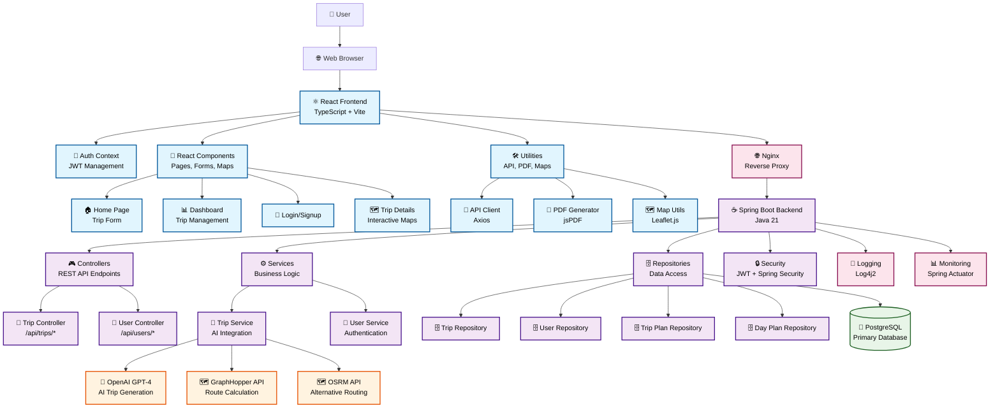
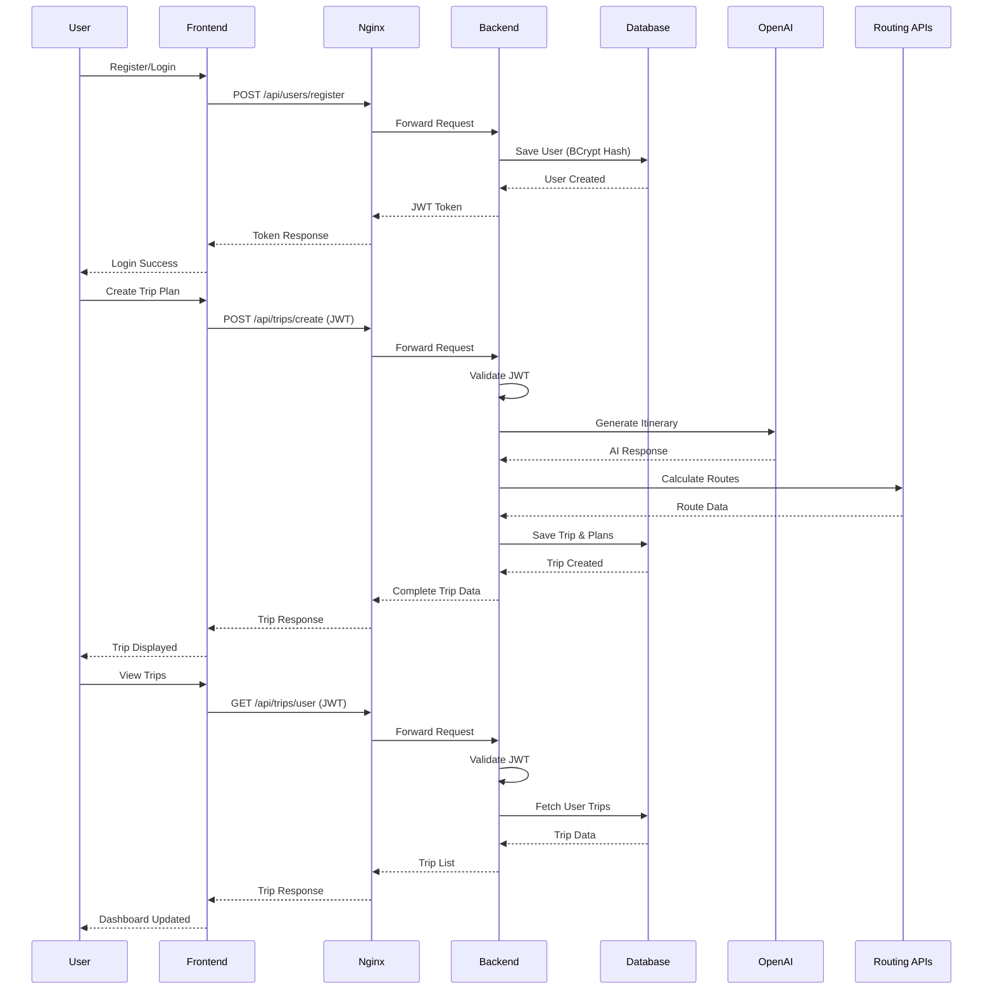
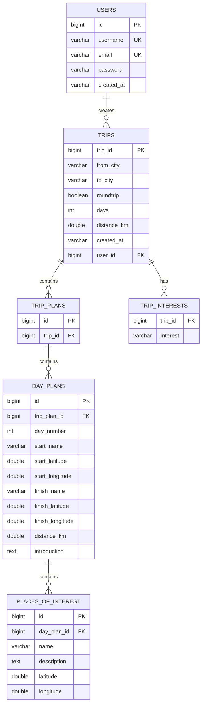
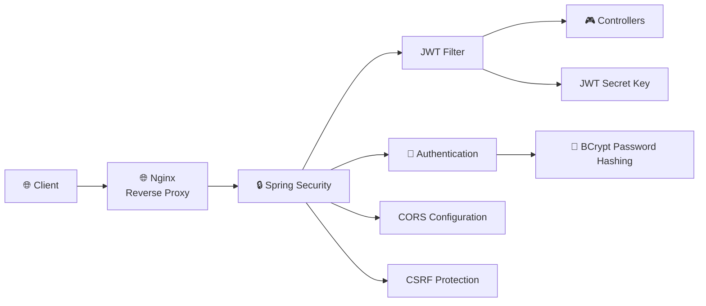
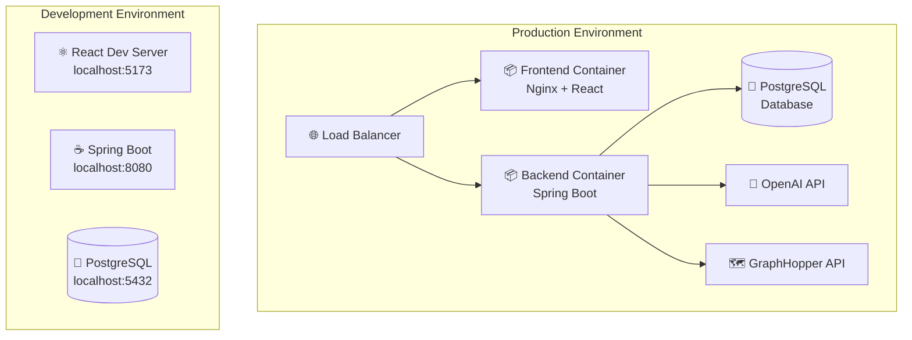

# Roadtrip.ai System Architecture Diagram

## Overview
Roadtrip.ai is a full-stack AI-powered road trip planning application that generates personalized itineraries using OpenAI's GPT-4. The system follows a modern microservices-inspired architecture with clear separation of concerns.

## System Architecture



## Data Flow Architecture



## Database Schema



## Component Architecture

### Frontend Components
```
src/
├── components/
│   ├── Button.tsx              # Reusable button component
│   ├── Card.tsx                # Card display component
│   ├── Header.tsx              # Navigation header
│   ├── Hero.tsx                # Landing page hero section
│   ├── TripForm.tsx            # Trip creation form
│   ├── TripCard.tsx            # Trip display card
│   ├── TripDetails.tsx         # Detailed trip view
│   ├── DayDetails.tsx          # Day-by-day itinerary
│   ├── TripOverviewMap.tsx     # Interactive map component
│   └── PDFDownloadButton.tsx   # PDF export functionality
├── pages/
│   ├── Home.tsx                # Landing page
│   ├── Login.tsx               # Authentication page
│   ├── SignUp.tsx              # User registration
│   └── Dashboard.tsx           # Main user dashboard
├── context/
│   └── AuthContext.tsx         # JWT authentication state
├── utils/
│   ├── api.ts                  # API client utilities
│   ├── pdfGenerator.ts         # PDF generation
│   ├── routeService.ts         # Route calculation
│   └── viteEnv.ts              # Environment configuration
└── styles/
    ├── index.css               # Global styles
    ├── Hero.css                # Hero section styles
    └── leaflet.css             # Map styles
```

### Backend Components
```
src/main/java/com/adendl/traveljournalai/
├── controller/
│   ├── TripController.java     # Trip REST endpoints
│   └── UserController.java     # User authentication endpoints
├── service/
│   ├── TripService.java        # Trip business logic + AI integration
│   └── UserService.java        # User management logic
├── repository/
│   ├── TripRepository.java     # Trip data access
│   ├── UserRepository.java     # User data access
│   ├── TripPlanRepository.java # Trip plan data access
│   └── DayPlanRepository.java  # Day plan data access
├── model/
│   ├── User.java               # User entity
│   ├── Trip.java               # Trip entity
│   ├── TripPlan.java           # Trip plan entity
│   ├── DayPlan.java            # Day plan entity
│   ├── PlaceOfInterest.java    # Place of interest entity
│   └── Location.java           # Location embeddable
├── config/
│   ├── SecurityConfig.java     # Spring Security configuration
│   ├── JwtConfig.java          # JWT configuration
│   └── JwtRequestFilter.java   # JWT authentication filter
└── utils/
    └── LoggingUtils.java       # Logging utilities
```

## Technology Stack

### Frontend
- **Framework**: React 18 with TypeScript
- **Build Tool**: Vite
- **Styling**: Tailwind CSS
- **Maps**: Leaflet.js + React Leaflet
- **Routing**: React Router DOM
- **Animations**: Framer Motion
- **PDF Generation**: jsPDF
- **HTTP Client**: Axios
- **Testing**: Jest + React Testing Library

### Backend
- **Framework**: Spring Boot 3
- **Language**: Java 21
- **Build Tool**: Gradle
- **Security**: Spring Security + JWT
- **Database**: PostgreSQL with JPA/Hibernate
- **Testing**: JUnit 5 + Mockito + Spring Boot Test
- **Logging**: Log4j2
- **Monitoring**: Spring Actuator

### Infrastructure
- **Web Server**: Nginx
- **Containerization**: Docker
- **Database**: PostgreSQL
- **External APIs**: OpenAI GPT-4, GraphHopper, OSRM

## Security Architecture



## Deployment Architecture



## API Endpoints

### Authentication
- `POST /api/users/register` - User registration
- `POST /api/users/login` - User authentication
- `GET /api/users/me` - Get current user

### Trip Management
- `POST /api/trips/create` - Create new trip plan
- `GET /api/trips/user` - Get user's trips
- `DELETE /api/trips/{id}` - Delete trip

## Data Flow Summary

1. **User Journey**: User registers/logs in → Creates trip → AI generates itinerary → Routes calculated → Trip saved → User views/manages trips

2. **AI Integration**: Trip details sent to OpenAI GPT-4 → AI generates day-by-day itinerary → Backend processes and structures data → Routes calculated via mapping APIs

3. **Data Persistence**: All trip data stored in PostgreSQL → Hierarchical structure (Trip → TripPlan → DayPlan → PlacesOfInterest)

4. **Security**: JWT-based authentication → BCrypt password hashing → CORS configuration → Stateless session management

5. **Frontend-Backend Communication**: RESTful API → JSON data exchange → JWT token authentication → Error handling and validation

This architecture provides a scalable, secure, and maintainable foundation for the AI-powered road trip planning application. 